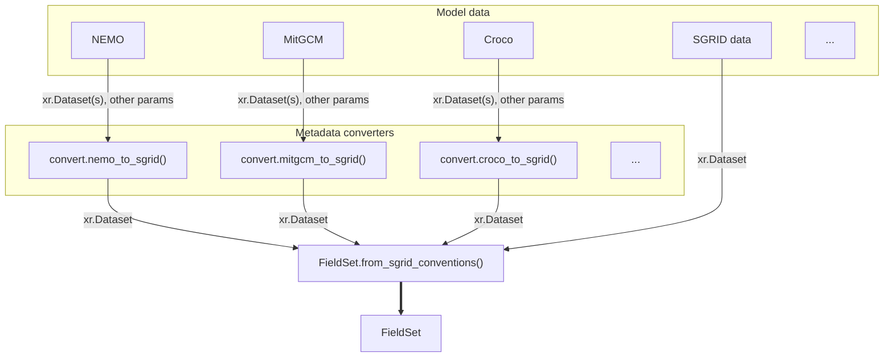

```mermaid
flowchart TD
    subgraph data [Model data]
        direction TB
        NEMO
        MitGCM
        Croco
        SGRID["SGRID data"]
        ...
    end
    subgraph converters [Metadata converters]
        NEMO -->|"xr.Dataset(s), other params"|convert.nemo_to_sgrid["convert.nemo_to_sgrid()"]
        MitGCM -->|"xr.Dataset(s), other params"|convert.mitgcm_to_sgrid["convert.mitgcm_to_sgrid()"]
        Croco -->|"xr.Dataset(s), other params"|convert.croco_to_sgrid["convert.croco_to_sgrid()"]
        ...2["..."]
    end

    convert.nemo_to_sgrid -->|xr.Dataset| from_sgrid_conventions
    convert.mitgcm_to_sgrid -->|xr.Dataset| from_sgrid_conventions
    convert.croco_to_sgrid -->|xr.Dataset| from_sgrid_conventions
    SGRID -->|xr.Dataset| from_sgrid_conventions["FieldSet.from_sgrid_conventions()"]

    from_sgrid_conventions ==> FieldSet
```
