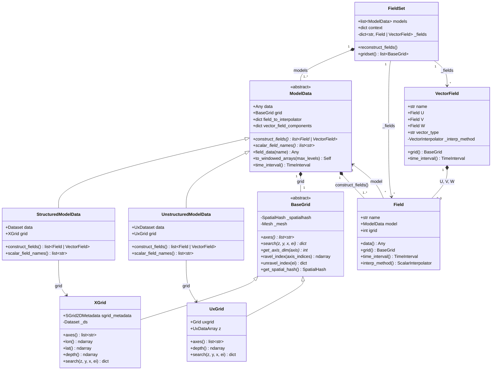

# Model-based Architecture of FieldSets

```mermaid
classDiagram
    direction TB

    class FieldSet {
        +list~ModelData~ models
        +dict context
        -dict~str, Field | VectorField~ _fields
        +reconstruct_fields()
        +gridset() list~BaseGrid~
    }

    class ModelData {
        <<abstract>>
        +Any data
        +BaseGrid grid
        +dict field_to_interpolator
        +dict vector_field_components
        +construct_fields()* list~Field | VectorField~
        +scalar_field_names()* list~str~
        +field_data(name) Any
        +to_windowed_arrays(max_levels) Self
        +time_interval() TimeInterval
    }

    class StructuredModelData {
        +Dataset data
        +XGrid grid
        +construct_fields() list~Field | VectorField~
        +scalar_field_names() list~str~
    }

    class UnstructuredModelData {
        +UxDataset data
        +UxGrid grid
        +construct_fields() list~Field | VectorField~
        +scalar_field_names() list~str~
    }

    class Field {
        +str name
        +ModelData model
        +int igrid
        +data() Any
        +grid() BaseGrid
        +time_interval() TimeInterval
        +interp_method() ScalarInterpolator
    }

    class VectorField {
        +str name
        +Field U
        +Field V
        +Field W
        +str vector_type
        -VectorInterpolator _interp_method
        +grid() BaseGrid
        +time_interval() TimeInterval
    }

    class BaseGrid {
        <<abstract>>
        -SpatialHash _spatialhash
        -Mesh _mesh
        +axes()* list~str~
        +search(z, y, x, ei)* dict
        +get_axis_dim(axis)* int
        +ravel_index(axis_indices) ndarray
        +unravel_index(ei) dict
        +get_spatial_hash() SpatialHash
    }

    class XGrid {
        +SGrid2DMetadata sgrid_metadata
        -Dataset _ds
        +axes() list~str~
        +lon() ndarray
        +lat() ndarray
        +depth() ndarray
        +search(z, y, x, ei) dict
    }

    class UxGrid {
        +Grid uxgrid
        +UxDataArray z
        +axes() list~str~
        +depth() ndarray
        +search(z, y, x, ei) dict
    }

    %% Inheritance
    ModelData <|-- StructuredModelData
    ModelData <|-- UnstructuredModelData
    BaseGrid <|-- XGrid
    BaseGrid <|-- UxGrid

    %% Composition
    FieldSet "1" *-- "1..*" ModelData : models
    ModelData "1" *-- "1" BaseGrid : grid
    ModelData "1" *-- "1..*" Field : construct_fields()
    VectorField "1" *-- "2..3" Field : U, V, W

    %% References
    Field "*" --> "1" ModelData : model
    FieldSet "1" --> "*" Field : _fields
    FieldSet "1" --> "*" VectorField : _fields

    %% Concrete pairings
    StructuredModelData --> XGrid : grid
    UnstructuredModelData --> UxGrid : grid
```
