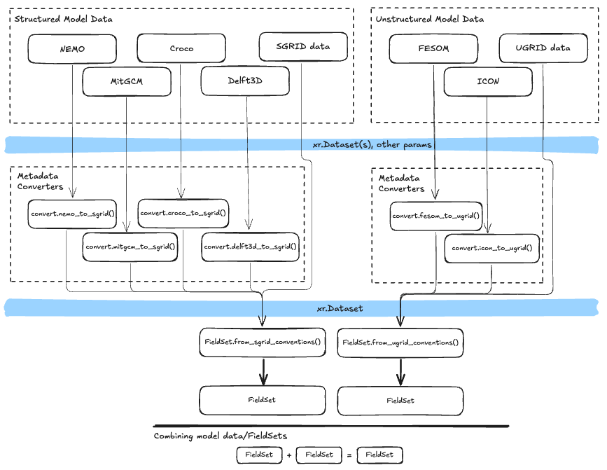

# Summary

Parcels [@Lange2017; @Delandmeter2019] is a highly customisable Lagrangian simulation framework.
Version 4 of the software is a major update which overhauls the software internals to natively leverage Xarray [@Hoyer2017] dataset objects.
This makes Parcels compatable with many new data formats (e.g., Zarr, Icechunk) and execution modes (e.g., streaming data from cloud buckets or other data providers - such as the [Copernicus Marine Data Store](https://marine.copernicus.eu/)).
With this update, Parcels also adds several new features including support for unstructured grid datasets (enabling simulations on (combinations of) different grid geometries), support for custom interpolators (surfacing to scientists even more control over the numerics of their simulation), and trajectory output in Parquet format.

# Statement of need

The first release of Parcels was in July 2017.
Since then, the geoscience modelling space has changed.
A significant portion of the geospatial science community has shifted from creating their own scripts for manipulating NetCDF data, to using open source software - namely Xarray - for working with multidimensional climate data.
Major benefits of this software include (a) providing a single in-memory, metadata-rich representation of a full NetCDF-like dataset, (b) its flexibility to manipulate datasets in other data-formats (e.g., Zarr, HDF5), and (c) its abstractions that facilitate easy data ingestion from network data sources.

Writing software that natively works from Xarray datasets provides a powerful abstraction layer allowing downstream developers to create software that works across data formats and data ingestion paradigms.
This is particularly important as climate datasets are continually increasing in resolution and size, preventing local file based storage, and datasets are increasingly being stored in modern data formats such as Zarr.

Another interesting change is that climate modellers are increasingly providing model output on different grid geometries, which have attractive features compared to conventional structured grids.
Running natively on these grid geometries, which can be represented as unstructured grids, without re-interpolation allows researchers to run simulations that fully capture the details from the original dataset.

Finally, an important point is the cross-domain generalisability of Lagrangian particle tracking tools within the geosciences.
Many of these tools originate from a specific domain, and (as evidenced by documentation, API naming, and input data support) cater to a userbase within the same domain.
This is despite the fact the numerics of the tools themselves is largely identical between the domains.
This results in both fractured communities, and toolsets whose usage mirrors the blurry boundaries of the domains themselves.
Having cross-domain tooling for Lagrangian particle tracking promotes cross-collaboration, software quality, building of better standards, and the overall impact of the software in users scientific workflows.

# State of the field

Parcels is not the only open-source Lagrangian particle tracking framework for research.
Other notable frameworks for oceanographic applications include OpenDrift [@dagestad_opendrift_2018], TRACMASS [@doos_evaluation_2017], Ariane [@blanke_kinematics_1997], Drifters.jl, TrackMPD [@jalon-rojas_3d_2019], Ichthyop [@barrier_ichthyop_2026], and the Connectivity Modelling System [@paris_connectivity_2013] -- each with their own strengths and limitations.
OpenDrift is very good for Search-and-Rescue simulations and operational forecasting, TRACMASS and Ariane excel in deterministic (analytical) particle tracking on structured grids, Drifters.jl is useful for advanced diagnostics, TrackMPD is designed specifically for marine plastic applications, and Ichthyop and the Connectivity Modelling System are especially useful for biological applications.
Furthermore, many of the hydrodynamic models also have their (online) particle tracking modules, but these are often tightly coupled to the specific model and lack the flexibility offered by standalone frameworks like Parcels.
In the atmosphere, FlexPart [@stohl_validation_1998] is a widely used Lagrangian particle tracking framework.
However, none of these packages come with the flexibility in terms of structured and unstructured grid support, and custom kernels and interpolators, that Parcels offers.

# Software design

When working with output from a single circulation model, version 4 of Parcels assumes data (i.e., the field data and mesh data) is all contained in a single Xarray Dataset object that has appropriate metadata.
This required metadata includes certain CF-convention metadata, providing information about important variables/coordinates and their units, as well SGRID or UGRID metadata, providing grid geometry information for structured grid data and unstructured grid data respectively.
This metadata rich object can either be opened directly from disk/a data store, or is constructed by the user from the component input/output files from their particular circulation model.
Parcels provides "converter" functions for various circulation models which understand model-specific conventions, that then attach this metadata appropriately.
This overall approach allows the internals of Parcels to assume a certain dataset structure and metadata richness, while still allowing the software to transparently facilitate users who come with metadata-poor model data.
The diagram in Figure 1 illustrates potential code paths when working from model data to a fully constructed FieldSet.
If a user wants to run a simulation with fields from different models, they load each model data into its own FieldSet and then combine the FieldSets together into a single FieldSet simply with an addition.

<!-- Writers note: The source for this image is at `data-ingestion.excalidraw`. Install the VScode Excalidraw Extension (https://marketplace.visualstudio.com/items?itemName=pomdtr.excalidraw-editor ) to easily edit it. -->

A strength of earlier Parcels versions has been the ability for users to write custom "kernels" which encode particle actions over the course of a simulation.
This flexibility has enabled users to model a wide range of physical phenomena, from plastic pollution to plankton and fish larvae.
Parcels version 4 adds custom interpolators, allowing users to also have control on how field data is interpolated at particle positions.
Users can use a range of pre-packaged interpolators, or write their own, and set them on a field-by-field basis overriding the default linear interpolators.

Version 4 of Parcels also improves generalisability to other domains, such as atmospheric or cryospheric particle tracking.
It allows the encoding of various input datasets, relaxes domain specific requirements, replaces domain specific terminology, and updates our overall branding.

Parcels version 4 also changes the output format from Zarr to Parquet, aligning better with that tabular nature of particle trajectory output.

# Example use-case

A key use-case of the Parcels version 4 is the combining of various model data which not only have different sources, but also very different grid geometries.
In this section we present an example simulation focused on the Dutch coast.

We combine flow data from Deltares’ 3D DCSM-FM model, SWAN Wave model data from KNMI, and wind model data from Copernicusmarine.
The 3D DCSM-FM model is an unstructured model, SWAN has a structured curvilear grid, and Copernicusmarine provides data on a structured rectilinear grid geometry.
We seed particles along the Dutch coast, and within estuaries facing the North Sea.
We advect the particles for a total of a month (from 2025-11-01 to 2025-12-01) with a timestep of 10 minutes.
Figure 2 shows the varied types of data and grid geometries that we combine, along with the resulting particle tracks.

# Research impact statement

Parcels has been cited in over 330 peer reviewed scientific papers so far mostly within the field of oceanography.

# AI usage disclosure

Large Language Models (Claude Opus 4.6, ChatGPT ... ) have been used in a guided manner for code generation, documentation, refactoring, and testing.
All LLM written code and documentation has been verified by the authors.
This manuscript was fully written by humans.

# Acknowledgements

This work has been funded via Nederlandse Organisatie voor Wetenschappelijk Onderzoek, Exacte en Natuurwetenschappen (VI.C.222.025) as part of the project “Tracing Marine Macroplastics by Unraveling the Ocean’s Multiscale
Transport Processes” and via the Warmworld ELPHE project, and compute on the SURF Research Cloud via project EINF-15719.

# References
