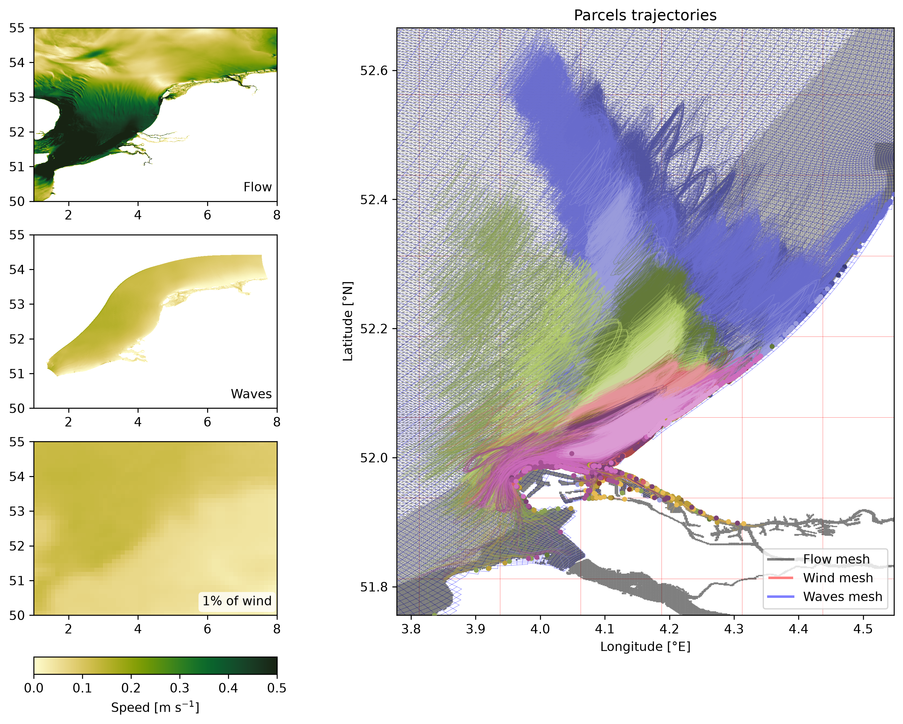

# Summary

Parcels [@Lange2017; @Delandmeter2019] is a highly customisable Lagrangian simulation framework.
Version 4 of the software is a major update which overhauls the software internals to natively leverage Xarray [@Delandmeter2019] dataset objects.
This makes Parcels compatable with many new data formats (e.g., Zarr, Icechunk) and execution modes (e.g., streaming data from cloud buckets or other data providers - such as the [Copernicus Marine Data Store](https://marine.copernicus.eu/)).
With this update Parcels also adds several new features, including support for unstructured grid datasets (enabling simulations on (combinations of) different grid geometries), support for custom interpolators (surfacing to scientists even more control over the numerics of their simulation), and trajectory output in Parquet format.

# Statement of need

The first release of Parcels was in July 2017.
Since then, several factors have changed the climate modelling space.
A significant portion of the geospatial science community has shifted from creating their own scripts for manipulating NetCDF data, to using open source software - namely Xarray - for working with multidimensional climate data.
Major benefits of this software include (a) providing a single in-memory, metadata-rich representation of a full NetCDF-like dataset, (b) its flexibility to manipulate datasets in other data-formats (e.g., Zarr, HDF5), and (c) its abstractions allowing for easy data ingestion from network data sources.

Writing software that natively works from Xarray datasets provides a powerful abstraction layer allowing downstream developers to create software that works across data formats and data ingestion paradigms.
This is particularly important as climate datasets are continually increasing in resolution and size, preventing local file based storage, and datasets are increasingly being stored in modern data formats such as Zarr.

Another interesting aspect is that climate modellers are increasingly providing model output on different grid geometries which have attractive features compared to conventional structured grids.
Running natively on these grid geometries, which can be represented as unstructured grids, without re-interpolation allows researchers to run simulations that capture the details from the original dataset.

Finally, some naming conventions and abstractions in the Parcels codebase were previously oriented towards oceanographers.
These domain specific items have been removed in this version, and our documentation has been adapted so that the applicability of Parcels to other (geo)scientific domains, such as atmospheric or cryospheric particle tracking, is more apparent.

# State of the field

> TODO: A description of how this software compares to other commonly-used packages in the research area. If related tools exist, provide a clear “build vs. contribute” justification explaining your unique scholarly contribution and why existing alternatives are insufficient.

# Software design

When working with output from a single circulation model, version 4 of Parcels assumes data (i.e., the field data and mesh data) is all contained in a single Xarray dataset object.
This object is either opened directly from disk/a data store, or is constructed by the user from the component Field and mesh files with help from a "converter" function.
These converters also attach relevant CF-convention and grid geometry metadata (SGRID metadata for structured data, UGRID metadata for unstructured data) to the dataset object, allowing the internals of Parcels to assume a certain dataset structure and metadata richness.
Below is a diagram illustrating the code path when working from model data to a fully constructed FieldSet.
If a user wants to run a simulation with fields from different models, they load each model data into its own FieldSet and then combine the FieldSets together into a single FieldSet.

A strength of earlier Parcels versions has been the ability for users to write "kernels" which define particle movement over the course of a simulation.
This added flexibility has enabled users to model a wide range of physical phenomena.
Parcels version 4 adds custom interpolators, allowing users to also have control on how field data is interpolated at particle positions.
Users can use a range of pre-packaged interpolators, or write their own, and set them on a field-by-field basis overriding the default linear interpolators.

Parcels version 4 also changes the output format from Zarr to Parquet, aligning better with that tabular nature of particle trajectory output.

# Example use-case

A key use-case of the Parcels version 4 is the combining of various model data which not only have different sources, but also very different grid geometries.
In this section we present an example simulation focused on the Dutch coast.

We combine flow data from Deltares’ 3D DCSM-FM model, SWAN Wave model data from Rijkswaterstad, and wind model data from Copernicusmarine.
The 3D DCSM-FM model is an unstructured model, while the other two use structured mesh geometries.
We seed particles along the Dutch coast, and within estuaries facing the North Sea.
We advect the particles for a total of a month (from 2025-11-01 to 2025-12-01) with a timestep of 10 minutes.
The figure below shows the varied types of data and grid geometries that we combine, along with the resulting particle tracks.

# Research impact statement

Parcels has been cited in over 330 peer reviewed scientific papers so far mostly within the field of oceanography.
This software update expands the reach of Parcels both to more users within oceanography, and in other domains.

# AI usage disclosure

Large Language Models (Claude Opus 4.6, ChatGPT ... ) have been used in a guided manner for code generation, documentation, refactoring, and testing.
All LLM written code and documentation has been verified by the authors.
This manuscript was fully written by humans.

# Acknowledgements

This work has been funded via Nederlandse Organisatie voor Wetenschappelijk Onderzoek, Exacte en Natuurwetenschappen (VI.C.222.025) as part of the project “Tracing Marine Macroplastics by Unraveling the Ocean’s Multiscale
Transport Processes” and via the Warmworld ELPHE project, and compute on the SURF Research Cloud via project EINF-15719.

# References
