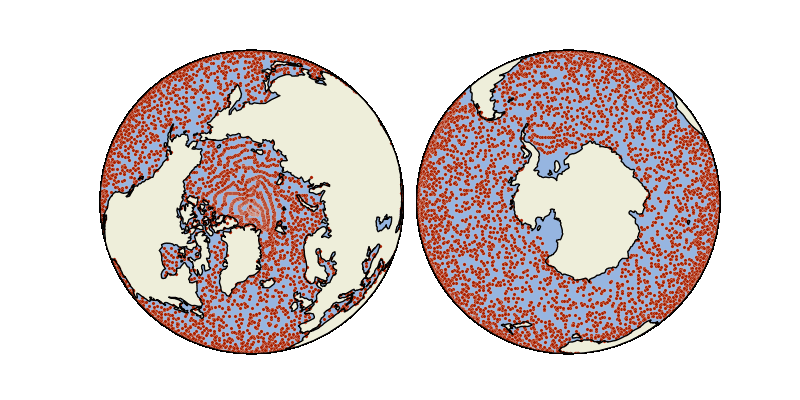

# 🎓 The homepage animation

This notebook shows how to create the animation on the homepage of the Parcels documentation. It uses a dataset of virtual particles at the surface of the global ocean simulation that can be retrieved from the [Copernicus Marine Service](https://marine.copernicus.eu/).

```python
import cartopy
import cartopy.crs as ccrs
import matplotlib.gridspec as gridspec
import matplotlib.pyplot as plt
import numpy as np
import polars as pl
import xarray as xr
from matplotlib.animation import FuncAnimation, PillowWriter

import parcels
```

The cell below provides the code needed to run this simulation - but because it is a time-consuming run (~20 minutes) and requires a login on the Copernicus Marine Service, we also provide the output file for download [here](https://github.com/Parcels-code/parcels-data/raw/refs/heads/main/data-parquet/copernicusmarine_globalsurface.parquet).

```python
particle_filename = "copernicusmarine_globalsurface.parquet"


def run_global_copernicusmarine():
    import copernicusmarine
    copernicusmarine.login()

    ds = copernicusmarine.open_dataset(
        dataset_id="cmems_mod_glo_phy-cur_anfc_0.083deg_P1D-m",
        variables=["uo", "vo"],
        start_datetime="2024-01-01",
        end_datetime="2024-12-31",
        minimum_depth=0.5,
        maximum_depth=0.5,
        service="arco-geo-series",
        chunk_size_limit=1,
    )
    ds = ds.fillna(0)

    ds_wrap = xr.concat(
        [
            ds,
            ds.isel(longitude=slice(0, 1)).assign_coords(
                longitude=ds.longitude.isel(longitude=slice(0, 1)) + 360
            ),
        ],
        dim="longitude",
    )
    ds = parcels.convert.copernicusmarine_to_sgrid(
        fields={"U": ds_wrap["uo"], "V": ds_wrap["vo"]}
    )
    fieldset = parcels.FieldSet.from_sgrid_conventions(ds)
    fieldset.UV.interp_method = parcels.interpolators.XFreeslip()
    fieldset.to_windowed_arrays()

    lon, lat = np.meshgrid(np.arange(-179, 180, 2), np.arange(-89, 90, 2))
    lon = lon.flatten()
    lat = lat.flatten()

    # Filter out particles that are not in the ocean (i.e. where speed is zero)
    u, v = fieldset.UV[np.zeros_like(lon), np.zeros_like(lat), lat, lon]
    speed = np.sqrt(u**2 + v**2)
    inocean = speed > 0

    pset = parcels.ParticleSet(fieldset, x=lon[inocean], y=lat[inocean])

    oufile = parcels.ParticleFile(
        particle_filename,
        outputdt=np.timedelta64(5, "D"),
    )

    def AdvectionRK2_periodic(particles, fieldset):  # pragma: no cover
        """Advection of particles using second-order Runge-Kutta integration,
        keeping particles within the periodic domain [-180, 180].
        """
        (u1, v1) = fieldset.UV[particles]
        x1 = particles.x + u1 * 0.5 * particles.dt
        x1 = ((x1 + 180) % 360) - 180
        y1 = particles.y + v1 * 0.5 * particles.dt
        (u2, v2) = fieldset.UV[
            particles.t + 0.5 * particles.dt, particles.z, y1, x1, particles
        ]
        particles.dx += u2 * particles.dt
        particles.dx = ((particles.dx + particles.x + 180) % 360) - (particles.x + 180)
        particles.dy += v2 * particles.dt

    pset.execute(
        [AdvectionRK2_periodic],
        dt=np.timedelta64(1, "h"),
        runtime=np.timedelta64(365, "D"),
        output_file=oufile,
    )


run_global_copernicusmarine()
```

The animation consists of two figures: the northern hemisphere and the southern hemisphere, using the [Cartopy package](https://cartopy.readthedocs.io/stable/) for map projections.

```python
fig = plt.figure(figsize=(8, 4))
gs = gridspec.GridSpec(ncols=8, nrows=4, figure=fig)

scat = [None, None]
particles = df.filter(pl.col("t") == pl.lit(plottimes[0]))

for i, central_latitude in enumerate([90, -90]):
    ax = fig.add_subplot(
        gs[:, :4] if central_latitude == 90 else gs[:, 4:],
        projection=ccrs.NearsidePerspective(
            central_latitude=central_latitude,
            central_longitude=-30,
            satellite_height=15000000,
        ),
    )
    ax.add_feature(cartopy.feature.LAND, zorder=1)
    ax.add_feature(cartopy.feature.OCEAN, zorder=1)
    ax.coastlines()
    scat[i] = ax.scatter(
        particles["x"],
        particles["y"],
        marker=".",
        s=25,
        c="#AB2200",
        edgecolor="white",
        linewidth=0.15,
        transform=ccrs.PlateCarree(),
    )


def animate(i):
    particles = df.filter(pl.col("t") == pl.lit(plottimes[i]))
    scat[0].set_offsets(np.c_[particles["x"], particles["y"]])
    scat[1].set_offsets(np.c_[particles["x"], particles["y"]])
    return scat[0], scat[1]


plt.rcParams["animation.html"] = "jshtml"
anim = FuncAnimation(fig, animate, frames=len(plottimes), interval=150, blit=True)
plt.close(fig)
anim.save(
    particle_filename.replace(".parquet", ".gif"),
    writer=PillowWriter(fps=6),
    savefig_kwargs={"transparent": True},
)
```

The resulting animation is then


