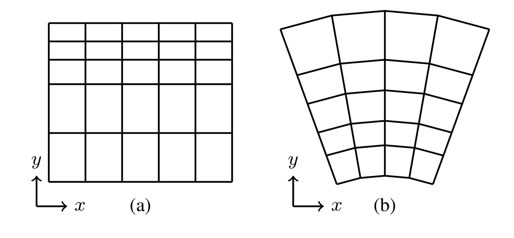

# 📖 Grids

In Lagrangian ocean analysis, virtual particle tracking requires the accurate interpolation of physical properties (flow velocities and tracer properties) to particle locations. The underlying data that forces the particle movement will likely be defined on a discretised grid. Parcels can natively handle two styles of grids; structured and (triangular) unstructured, where parcels `Field` objects exist on a (structured) `parcels.XGrid` or (unstructured) `parcels.UxGrid`. Here we describe these grids on a conceptual level.

Under the hood, every `Field` in a `FieldSet` has a `grid` attribute. This `grid` stores the spatial and temporal information of the Field coordinates. The number of Grids in a FieldSet is thus always smaller or equal to the number of Field objects; and this is what the "grid number" column in `FieldSet.describe()` refers to.

## Structured grids

A structured grid is composed of quadrilateral elements, that are indexed using logical 2D or 3D indices, like $(i,j,k)$. In `xarray` terminology, these indices correspond to `dimensions`, for example [...]. In structured grids, grid cell neighbours are easily found by decrementing or incrementing these dimensions.

There are two styles of structured grids, rectilinear and curvilinear, as shown in Figure 1. Rectilinear grids are nearly always aligned with the coordinate axes (that is, there is a one-to-one mapping between the dimensions and the physical coordinate space), making them simple and computationally efficient to query. However, they're limited by the fact that it is difficult to resolve complex coastlines without high resolution, and they suffer from singularities in the flow fields at the poles where the grid lines converge. Curvilinear grids allow for curved grid lines, which allow for better representation of coastlines. They often move the poles onto land to avoid singularities occuring in the ocean. However, they become trickier to work with, as the spatial positions of their vertices are stored in separate 2D arrays, and moving to an eastward neighbour is not as simple as incrementing the $i$-th coordinate by 1.

## Unstructured grids

TODO: For Joe.

## How your data may be defined

Regardless of your grid type, how your data is defined on your grid is equally important. Here, we will describe how you can interpret your data at a very general level, and the concept applies for any $n$-gon ($n$-sided polygon with $n \ge 3$).

### Nodes, edges, and faces

Let's assume we have a simple 2D rectlinear grid. The grid is composed of a number of nodes (or vertices), connected by edges, which together construct grid cells and grid cell faces. In Figure 2, we draw a simple grid cell. Here, your data may be defined on the corners of the grid cell (the nodes/vertices), at the centre of the cell face, or across a cell edge.

You will need to make several assumptions about your data. Your data may represent a point-wise "sample" of some field. For example, velocity data may be defined at the nodes of your grid, and a fairly safe assumption to make is that you can bi-linearly interpolate these data points to your particle positions. In such an example, your velocity field may look like Figure 3.

Alternatively, your data may represent an "average value" across a cell face. For example, your temperature and salinity data may be defined at the cell centre, and represent an average value for the entire grid cell. A fairly safe assumption to make is that you can nearest-neighbour interpolate these data points to your particle positions. In such a case, your temperature field may look like figure 4.

Lastly, your data may represent a value across a cell edge. For example, in (2D) Arakawa C-grid datasets, velocities are defined across an edge as they represent a "flux" across that cell edge. [for some reason an accepted assumption is] to perform a 1D linear interpolation of the zonal velocity in the zonal direction, and similarly a 1D linear interpolation of the meridional velocity in the meridional direction. In such a case, your velocity field may look like figure 5.

